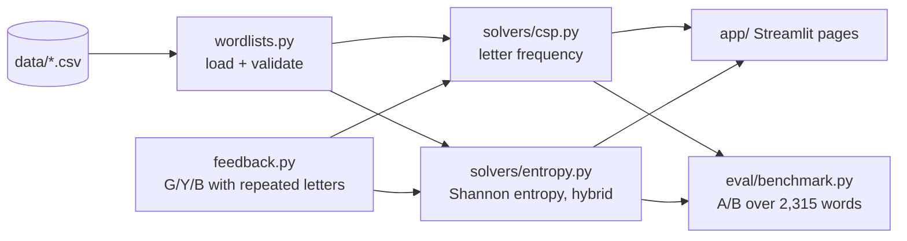

# Wordle Solver

[](https://github.com/vidit-16/WordleSolver/actions/workflows/ci.yml)
[](LICENSE)
[](pyproject.toml)

**Constraint satisfaction and information theory, compared on the same Wordle board.**

This project tests two ways of choosing the next Wordle guess. The CSP solver reduces the candidate set using Wordle's feedback rules and ranks the remaining words by letter frequency. The hybrid solver uses information gain to choose exploratory guesses while the candidate set is large, then switches to solution-based scoring near the end.

There is a live Streamlit app if you want to play with both approaches:

https://wordle--solver.streamlit.app/

---

## What it actually does

Both solvers start from the same list of valid solutions and process the exact `G/Y/B` feedback produced by a guess.

**CSP solver**

The candidate set is filtered after every guess. A word is scored using the frequency of its unique letters across the remaining candidates, so the next suggestion favours letters that are likely to split the search space.

**Hybrid entropy solver**

When more than five candidates remain, the solver evaluates guesses by Shannon entropy over the possible feedback patterns. When the search space becomes small, it falls back to the same solution-based frequency score used by the CSP solver.

The implementation therefore has a clear tradeoff: CSP favours cheap candidate scoring, while entropy spends more computation to choose guesses that are useful for exploration.

## Evaluation

The evaluation script runs both solvers against all **2,315 official Wordle solutions** in the repository.

| Solver | Games | Win rate | Avg guesses (wins) | Max | Losses | ms/game |
| --- | ---: | ---: | ---: | ---: | ---: | ---: |
| CSP | 2,315 | 99.05% | 3.650 | 6 | 22 | 77.5 |
| Hybrid entropy | 2,315 | 99.78% | 3.679 | 6 | 5 | 1,003.6 |

The hybrid solver loses 17 fewer games but spends roughly 13x the compute per game.
Full guess distributions: [`docs/benchmark_results.md`](docs/benchmark_results.md).

The result is not simply "entropy is better": the hybrid solver has a slightly higher average number of guesses, while solving a larger share of the test set. The useful comparison is therefore between **average efficiency and coverage**, not a single winning metric.

Run the benchmark with:

```bash
python -m wordle_solver.eval.benchmark --workers 8 --out docs/benchmark_results.md
python -m wordle_solver.eval.benchmark --sample 200      # quick seeded subset
```

## The Wordle logic

The feedback implementation handles the normal green, yellow and black cases while respecting repeated letters. After each guess, candidates survive only when their generated feedback pattern exactly matches the observed pattern.

That same feedback function is used during evaluation, so the solver is tested against the same game logic it uses while playing.

## App

The Streamlit app exposes the two approaches separately:

```text
Wordle Solver
├── CSP Solver
└── Hybrid Entropy Solver
```

For either approach, enter a five-letter guess and the resulting `G/Y/B` pattern. The app keeps the candidate state, shows the number of remaining solutions, suggests the next guess, and records the guess history.

## Architecture



## Project structure

```text
.
├── app.py                     # Streamlit entry point
├── pages/                     # thin Streamlit page wrappers
├── wordle_solver/
│   ├── config.py              # paths, limits, pool sizes (env overridable)
│   ├── feedback.py            # Wordle feedback + candidate filtering
│   ├── wordlists.py           # CSV loading with validation
│   ├── solvers/               # base, CSP, hybrid entropy
│   ├── app/                   # page rendering + session state
│   └── eval/benchmark.py      # A/B benchmark CLI
├── data/                      # valid_guesses.csv, valid_solutions.csv
├── tests/                     # unit, parity, smoke; legacy/ holds the original evaluation.py
├── scripts/mutation_test.py
├── docs/                      # benchmark and mutation results
├── Dockerfile
└── pyproject.toml             # ruff, pytest, coverage
```

## Run locally

```bash
pip install -r requirements.txt
streamlit run app.py
```

Or with Docker:

```bash
docker build -t wordle-solver .
docker run -p 8501:8501 wordle-solver     # http://localhost:8501
```

The repository contains separate lists for valid guesses and official solutions. The benchmark uses the complete solution list rather than a sampled subset.

## Testing

```bash
pip install -r requirements-dev.txt
ruff check . && ruff format --check .
pytest --cov                      # 75 tests, 99% coverage of wordle_solver/
python scripts/mutation_test.py   # mutation score for the core logic
```

- **Unit tests** for feedback (including repeated letters), scoring, entropy, both solvers, word-list validation and the app session state.
- **Parity tests** check the refactored package against the original `evaluation.py` (kept verbatim in `tests/legacy/`): feedback on 3,000 random word pairs, scoring and entropy, and solver guess sequences.
- **Smoke tests** run `app.py` and both pages with Streamlit's `AppTest`, including invalid-feedback handling.
- **Mutation testing**: `scripts/mutation_test.py` applies 64 operator and constant mutations to the feedback, solver and session modules; **57 are killed (89.1%)**. The 7 survivors change only error-message text, comments, or swap `None` for `""` as a consumed-letter marker, none of which alter behaviour. Details: [`docs/mutation_results.md`](docs/mutation_results.md).

## What I was interested in

The interesting part of the project is not just solving Wordle. It is seeing what happens when two different decision rules operate under the same feedback mechanism.

CSP asks: **what can still be true?**

Entropy asks: **which guess will tell us the most?**

The hybrid approach combines those ideas by using information gain while there is still a lot to learn, then narrowing down with solution-based scoring once the state is constrained.